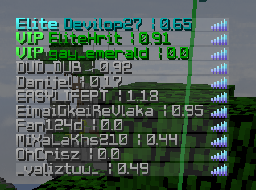
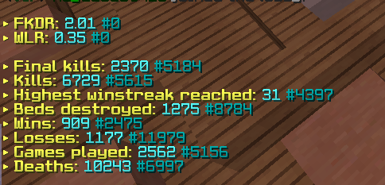
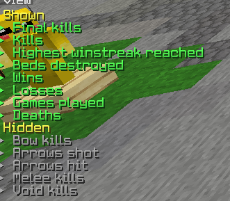

# Pika-Network Statistics Mod
## PikaStatsMod

PikaStatsMod lets you check anyone's statistics in-game using the command `/pikastats` AND shows fkdr of players in player tab in BW and SW

Tab showing the fkdr of other players

To check my bedwars statistics
`/pikastats Chetan0402 bw`

Want skywars weekly solo instead?
`/pikastats Chetan0402 sw weekly solo`

This mod currently only supports Bedwars, skywars,unranked practice&ranked practice

Update v1.0.1:
Added Unranked & ranked practice too
`/pikastats Chetan0402 uprac`

Update v1.0.2:
Added WLR and FKDR into stats.

Update v1.0.3/4:
Added FKDR into tab

Update v1.0.5:
Added tab options in config

Change the order and visibility of stats using `/statsconfig`
